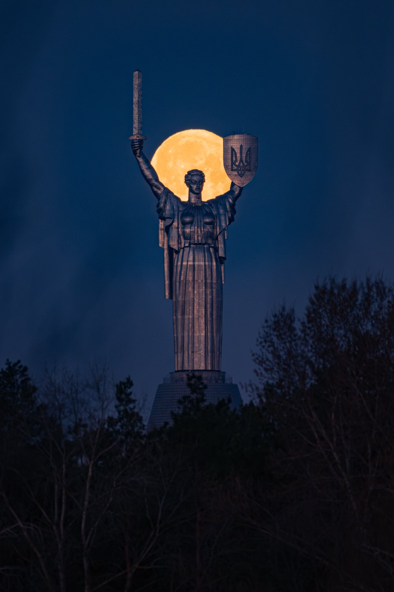
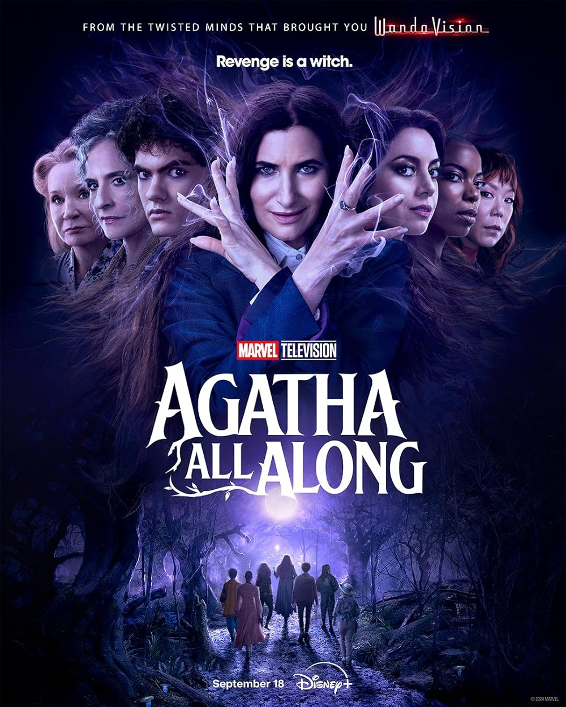
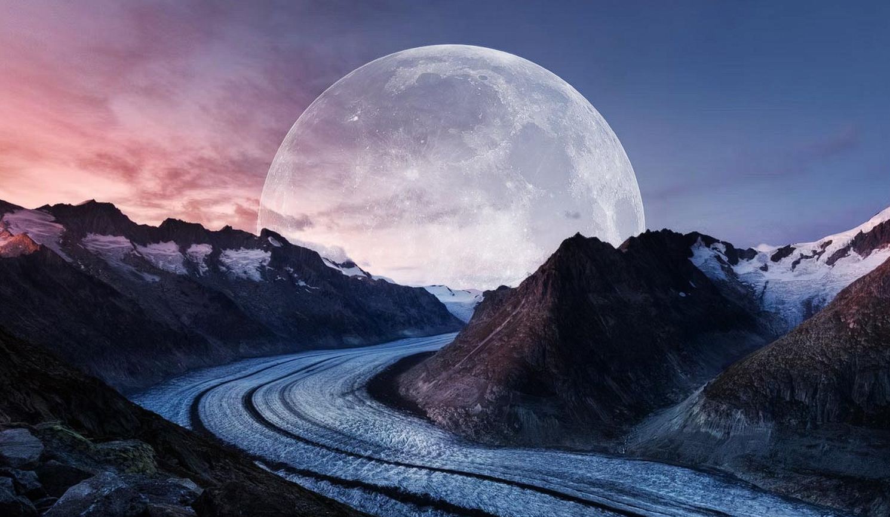
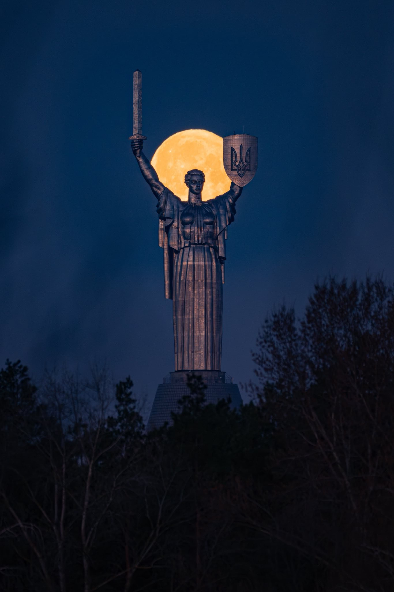
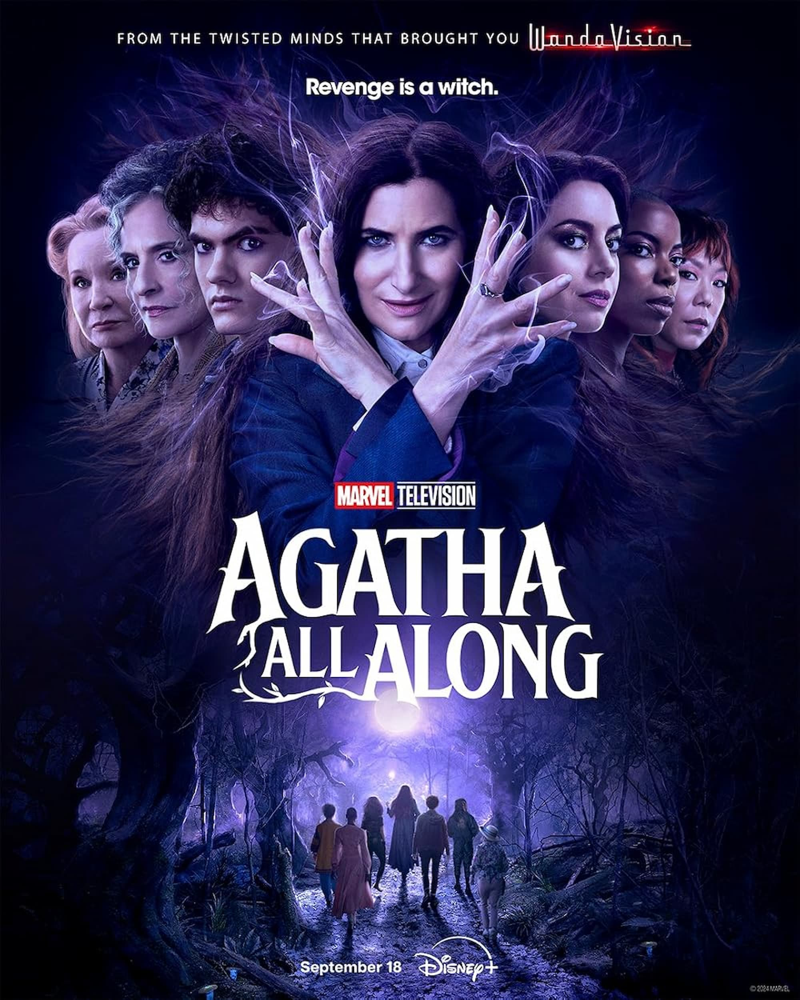

# Практика №1 “Оптимізація зображень за допомогою Squoosh”
## Каст Олена ІПЗ-2.02
## Початкові зображеня

| Назва зображення | Формат зображення | Розмір зображення | Вага зображення |
|------------------|-------------------|-------------------|-----------------|
| photo            | jpg               | 1366x2048         | 172 КБ          |
| screenshot       | png               | 1490x867          | 2,03 МБ         |
| with_text        | jpg               | 1000x1250         | 191 Kb          |

### Фото:

### Скіншот:

### З текстом:

## Lossless

### WebP

| Назва зображення | Формат зображення | Розмір зображення | Вага зображення | Зміна   |
|------------------|-------------------|-------------------|-----------------|---------|
| photo            | webp              | 1366x2048         | 985 Kb          | +471%   |
| screenshot       | webp              | 1490x867          | 1.3 МБ          | -36%    |
| with_text        | webp              | 1000x1250         | 1.11 МБ         | +480%   |

### Фото:

### Скіншот:

### З текстом:

### Png

| Назва зображення | Формат зображення | Розмір зображення | Вага зображення | Зміна |
|------------------|-------------------|-------------------|-----------------|-------|
| photo            | png               | 1366x2048         | 2,34 МБ         | +1263%|
| screenshot       | png               | 1490x867          | 2.07 Mb         | +2%   |
| with_text        | png               | 1000x1250         | 2 Mb            | +948% |

### Фото:

### Скіншот:

### З текстом:

## MozJPEG (100% quality)

| Назва зображення | Формат зображення | Розмір зображення | Вага зображення | Зміна |
|------------------|-------------------|-------------------|-----------------|-------|
| photo            | jpg               | 1366x2048         | 496 Kb          | +188% |
| screenshot       | jpg               | 1490x867          | 1.07 МБ         | -47%  |
| with_text        | jpg               | 1000x1250         | 678 Kb          | +255% |

### Фото:
/photo.jpg)

### Скіншот:
/screenshot.jpg)

### З текстом:
/with_text.jpg)

## MozJPEG (75% quality)

| Назва зображення | Формат зображення | Розмір зображення | Вага зображення | Зміна |
|------------------|-------------------|-------------------|-----------------|-------|
| photo            | jpg               | 1366x2048         | 90.6 Kb         | -47% |
| screenshot       | jpg               | 1490x867          | 124 Kb          | -94% |
| with_text        | jpg               | 1000x1250         | 164 Kb          | -14% |

### Фото:
/photo.jpg)

### Скіншот:
/screenshot.jpg)

### З текстом:
/with_text.jpg)

## MozJPEG (50% quality)

| Назва зображення | Формат зображення | Розмір зображення | Вага зображення | Зміна |
|------------------|-------------------|-------------------|-----------------|-------|
| photo            | jpg               | 1366x2048         | 90.6 Kb         | -72% |
| screenshot       | jpg               | 1490x867          | 71.1 Kb         | -96% |
| with_text        | jpg               | 1000x1250         | 97.3 Kb         | -49% |

### Фото:
/photo.jpg)

### Скіншот:
/screenshot.jpg)

### З текстом:
/with_text.jpg)

## WebP (100% quality)

| Назва зображення | Формат зображення | Розмір зображення | Вага зображення | Зміна |
|------------------|-------------------|-------------------|-----------------|-------|
| photo            | webp              | 1366x2048         | 322 Kb          | +87%  |
| screenshot       | webp              | 1490x867          | 466 Kb          | -77%  |
| with_text        | webp              | 1000x1250         | 447 Kb          | +134% |

### Фото:
/photo.webp)

### Скіншот:
/screenshot.webp)

### З текстом:
/with_text.webp)

## WebP (75% quality)

| Назва зображення | Формат зображення | Розмір зображення | Вага зображення | Зміна |
|------------------|-------------------|-------------------|-----------------|-------|
| photo            | webp              | 1366x2048         | 47 Kb           | -73%  |
| screenshot       | webp              | 1490x867          | 107 Kb          | -95%  |
| with_text        | webp              | 1000x1250         | 144 Kb          | -25%  |

### Фото:
/photo.webp)

### Скіншот:
/screenshot.webp)

### З текстом:
/with_text.webp)

## WebP (50% quality)

| Назва зображення | Формат зображення | Розмір зображення | Вага зображення | Зміна |
|------------------|-------------------|-------------------|-----------------|-------|
| photo            | webp              | 1366x2048         | 32.9 Kb         | -81%  |
| screenshot       | webp              | 1490x867          | 73.8 Kb         | -96%  |
| with_text        | webp              | 1000x1250         | 107 Kb          | -44%  |

### Фото:
/photo.webp)

### Скіншот:
/screenshot.webp)

### З текстом:
/with_text.webp)

## AVIF (100% quality)

| Назва зображення | Формат зображення | Розмір зображення | Вага зображення | Зміна |
|------------------|-------------------|-------------------|-----------------|-------|
| photo            | avif              | 1366x2048         | 233 Kb          | +35%  |
| screenshot       | avif              | 1490x867          | 572 Kb          | -72%  |
| with_text        | avif              | 1000x1250         | 386 Kb          | +102% |

### Фото:

### Скіншот:

### З текстом:

## AVIF (75% quality)

| Назва зображення | Формат зображення | Розмір зображення | Вага зображення | Зміна |
|------------------|-------------------|-------------------|-----------------|-------|
| photo            | avif              | 1366x2048         | 59.1 Kb         | -66%  |
| screenshot       | avif              | 1490x867          | 157 Kb          | -92%  |
| with_text        | avif              | 1000x1250         | 174 Kb          | -9%   |

### Фото:

### Скіншот:

### З текстом:

## AVIF (50% quality)

| Назва зображення | Формат зображення | Розмір зображення | Вага зображення | Зміна |
|------------------|-------------------|-------------------|-----------------|-------|
| photo            | avif              | 1366x2048         | 21.7 Kb         | -87%  |
| screenshot       | avif              | 1490x867          | 65.3 Kb         | -97%  |
| with_text        | avif              | 1000x1250         | 106 Kb          | -44%  |

### Фото:

### Скіншот:

### З текстом:

## Для вебу (максимальна ширина 1200px)

| Назва зображення | Формат зображення | Розмір зображення | Вага зображення | Зміна |
|------------------|-------------------|-------------------|-----------------|-------|
| photo            | jpg               | 1200x1799         | 69.1 Kb         | -60%  |
| screenshot       | jpg               | 1200x698          | 86 Kb           | -96%  |
| with_text        | jpg               | 1200x1500         | 264 Kb          | +10%  |

### Фото:

### Скіншот:

### З текстом:

## Для мобільних пристроїв (максимальна ширина 600px)

| Назва зображення | Формат зображення | Розмір зображення | Вага зображення | Зміна |
|------------------|-------------------|-------------------|-----------------|-------|
| photo            | jpg               | 600x900           | 23.3 Kb         | -87%  |
| screenshot       | jpg               | 600x349           | 24.5 Kb         | -99%  |
| with_text        | jpg               | 600x750           | 66 Kb           | -65%  |

### Фото:

### Скіншот:

### З текстом:

## Для Retina-дисплеїв (2x версія зображення)

| Назва зображення | Формат зображення | Розмір зображення | Вага зображення | Зміна |
|------------------|-------------------|-------------------|-----------------|-------|
| photo            | jpg               | 2732x4096         | 264 Kb          | +53%  |
| screenshot       | jpg               | 2980x1734         | 336 Kb          | -83%  |
| with_text        | jpg               | 2000x2500         | 415 Kb          | +117% |

### Фото:

### Скіншот:

### З текстом:

## Висновок
Підсумковуючи, для різних типів зображення формати та параметри відрізняються.
Також цей застосунок краще працює саме з .png файлами, як мінімум, якщо порівнювати з .jpg, особливо що стосується збережння якості без збільшення ваги файлу.
У .jpg зображеннях майже неможливо зберігти якість зображення при зменьшені ваги.
Але найоптимальніший формат для усіх зображень один AVIF, він найкраще зберігає якість при зменьшені зображення.
Також є помітна різниця якості між звичайними зображеннями і зображенням з текстом, там більш помітно коли якість зменьшується.
Тож для адаптації зображень під різні цілі важливо враховувати:
1) формат зображення (фото, графіка, текст тощо),
2) цільове застосування (веб, мобільні, Retina),
3) баланс між якістю та розміром,
4) тип файлу (.jpg, .png, .webp, тощо).

