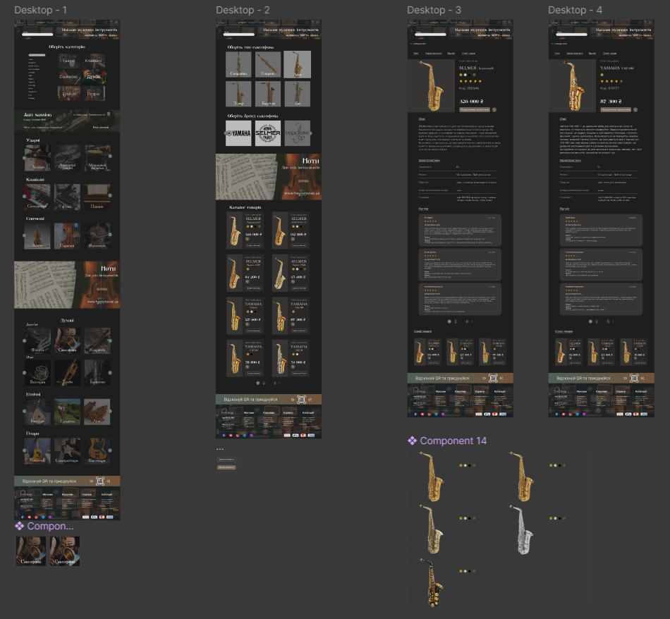

# Практична робота №12
## Каст Олена ІПЗ-2.02
### Дизайн у Figma: 
https://www.figma.com/design/6YdGOEoyOvRfD9LH2RfrkZ/12-%D0%BF%D1%80%D0%B0%D0%BA%D1%82%D0%B8%D0%BA%D0%B0?node-id=0-1&t=qWZO55lHQd3tlvPI-1
### Клікабельний прототип у Figma: 
https://www.figma.com/proto/6YdGOEoyOvRfD9LH2RfrkZ/12-%D0%BF%D1%80%D0%B0%D0%BA%D1%82%D0%B8%D0%BA%D0%B0?page-id=0%3A1&node-id=1-2&p=f&viewport=-452%2C13%2C0.12&t=kibVtTVbtTf42vjy-1&scaling=min-zoom&content-scaling=fixed&starting-point-node-id=1%3A2
### Скріншоти: 

