# Практика №1 “Дослідження кольорових гармоній та інструментів аналізу кольору в Adobe Color”
## Каст Олена ІПЗ-2.02

## Теорія/Гармонія кольорів
Колірна гармонія — це розташування кольорів у дизайні найпривабливішим та найефективнішим способом для сприйняття користувачів.
Існує кілька основних типів колірних гармоній: монохромна, аналогова, комплементарна, тріадна, тетрадна та інші. 

### Базовий колір
#### #9F43DC

## Палітри для кожного типу гармонії

### Аналогічна 
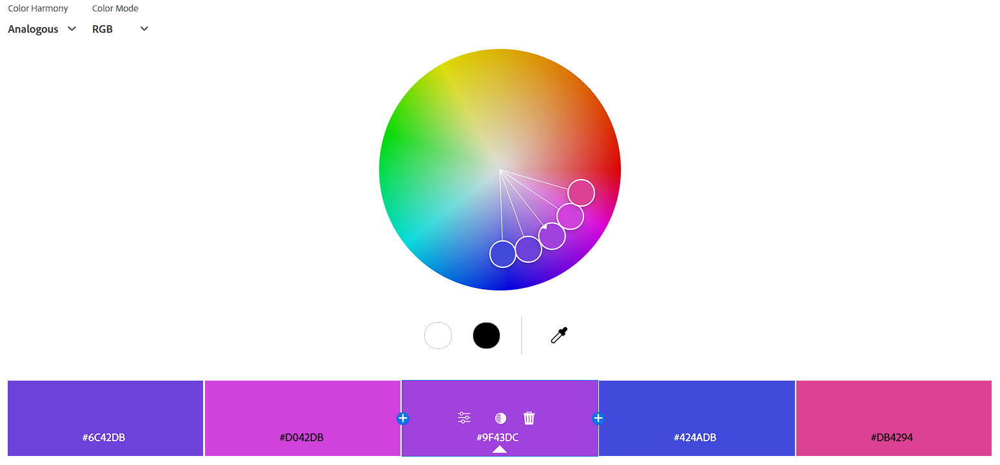
#### Базовий колір
#9F43DC
#### Ефект:
Аналогова гармонія використовується для плавних, м'яких палітр, без сильної контрастності. Тож таке поєднання дає відчуття спокою, затишку, єдності картинки.

### Монохроматична 
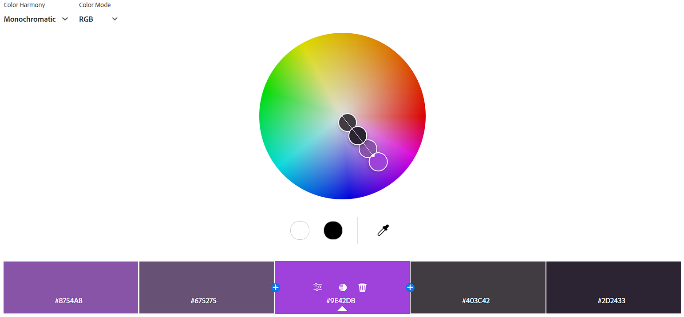
#### Базовий колір
#9F43DC
#### Ефект:
Монохроматична гармонія базується на одному кольорі, але з різними відтінками, тонами та насиченістю. Тож таке поєднання виглядає елегантно і стримано, викликаючи відчуття стабільності та простоти.

### Тріада 
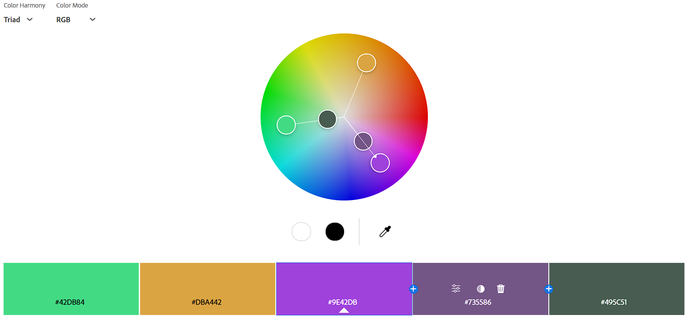
#### Базовий колір
#9F43DC
#### Ефект:
Тріадна гармонія використовує три кольори, що рівномірно розподілені на колірному колі, це створює яскраві та контрасні поєднання. Тріада створює енергійний вигляд із сильним контрастом, що викликає відчуття динаміки та різноманітності.

### Комплементарна 
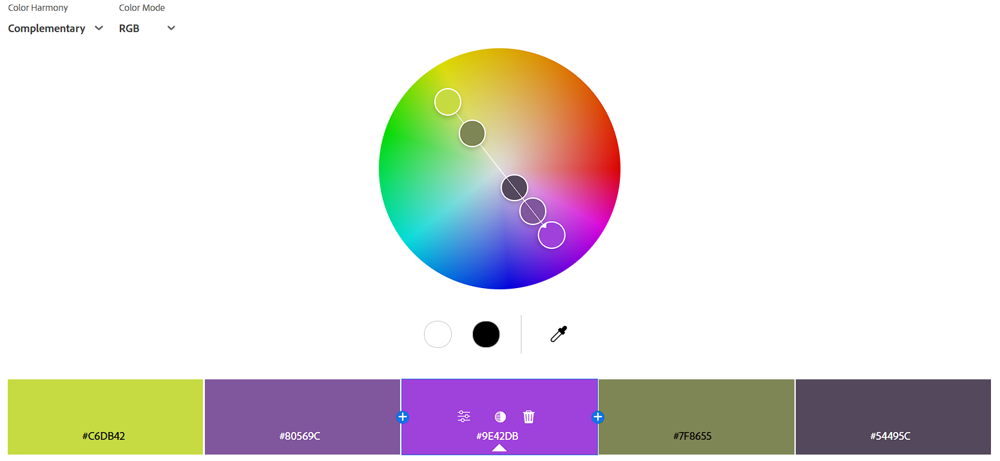
#### Базовий колір
#9F43DC
#### Ефект:
Комплементарна гармонія бере за основу два кольори, які знаходяться навпроти, що створює сильний контраст, а також додаює різні відтінки на цьому проміжку. Тож таке поєднання створює яскравий, привабливий контраст, що викликає увагу та відчуття рівноваги між теплом і прохолодою.

### Розділена комплементарна 
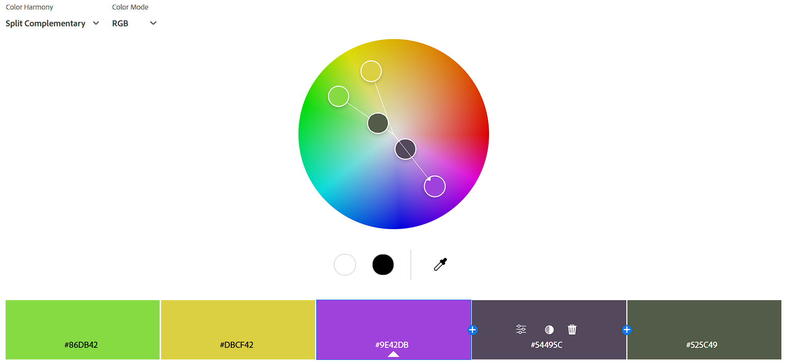
#### Базовий колір
#9F43DC
#### Ефект:
Розділена комплементарна гармонія бере комплементарний колір і додає два кольори, що знаходяться поруч із ним, що створює м'якіший контраст у порівнянні з комплементарною гармонією. І це створює збалансований і приємний для ока вигляд з м'яким контрастом.

### Квадрат 
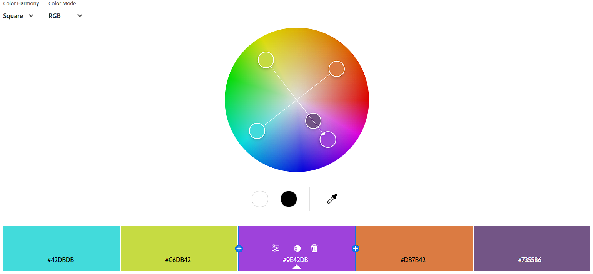
#### Базовий колір
#9F43DC
#### Ефект:
Квадратна гармонія використовує чотири кольори, що розташовані на колірному колі на рівній відстані. Таке поєднання створює яскраву, різноманітну палітру.

### Кастомна 
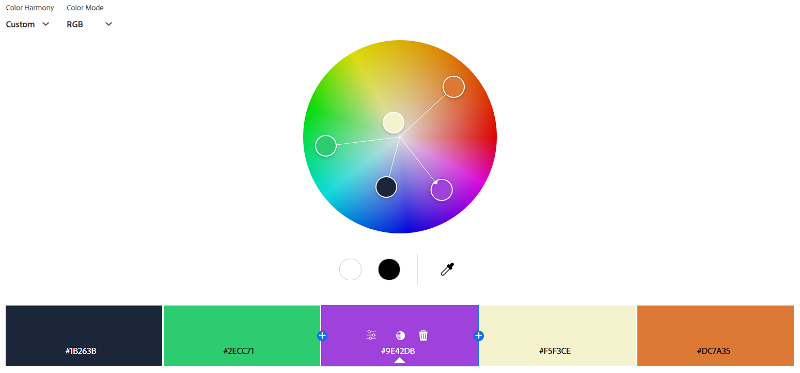
#### Базовий колір
#9F43DC
#### Ефект:
Це палітра з сильною контрастістю, зроблена на основі квадратної гармонії, також застосовуються різні відітнки.

## Створення палітри зображення
#### Зображення :
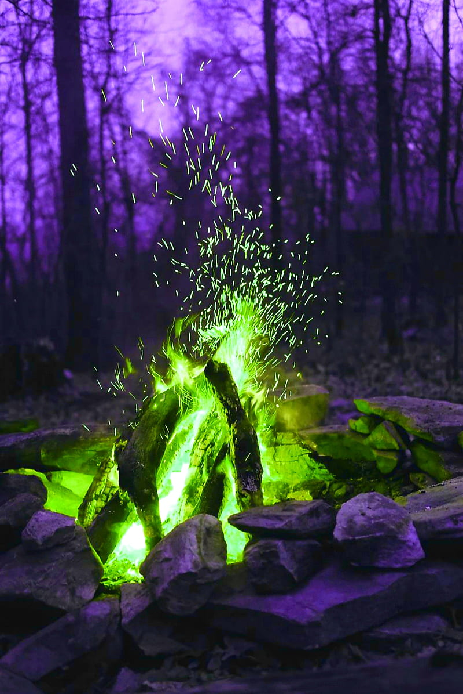

### Colorful:
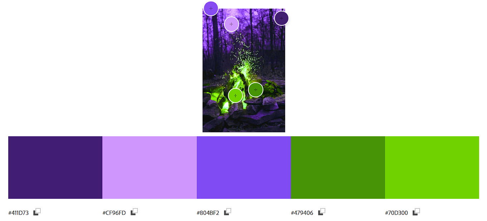

### Muted:
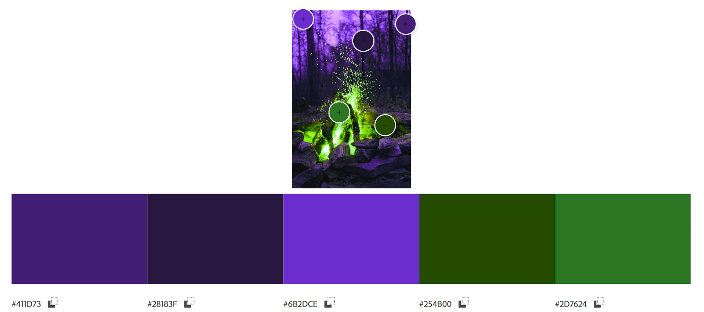

#### Обидві палітри можуть підійти для інтерфейсу додатка, треба дивитися саме які саме вимоги.
Colorful більше підходить для чогось яскравого, акцентного, тоді як muted для спокійного, серйозного.
### Градієнти
#### Так як у картинці два контрастних кольора, то створення градієнту може бути грязне і краще створити два окремих градієнта.
#### Перший градієнт: 
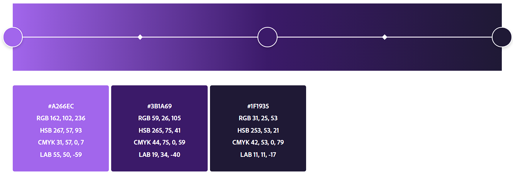
#### Другий градієнт: 
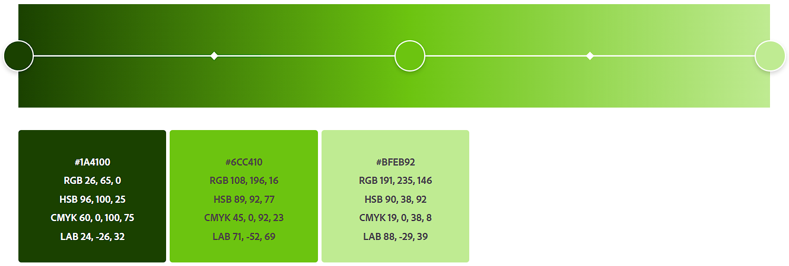

## Аналіз контрасту
#### Кольори з кастомної палітри: 
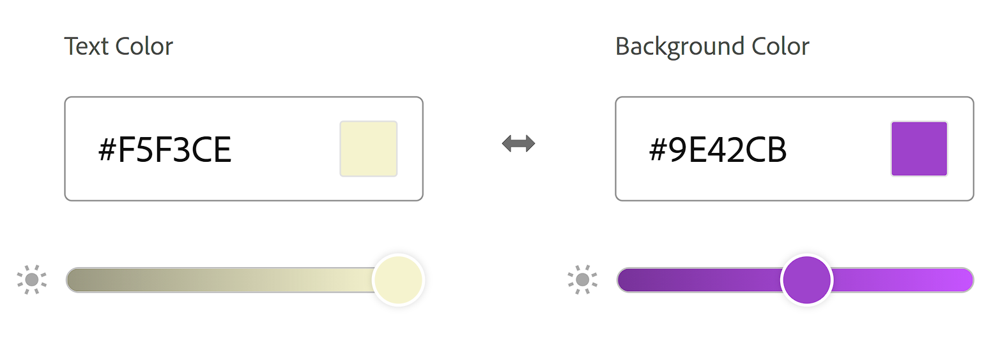
#### Рівень контрастності: 
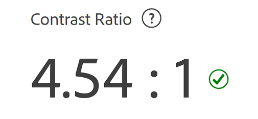
#### Перевірки для текстів та іконок:: 
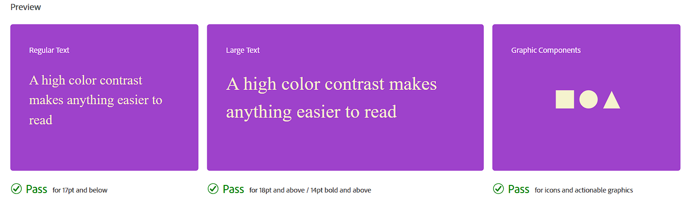

## Висновок
Різні палітри можуть підійти для різних інтерфейсів.
Наприклад, монохроматична підходить для більш стриманих, спокійних інтерфейсів, тоді як тріда та квадрат для яскравих, насичених.
Тому не можна точно сказати як з типів гармонії підходить для інтерфейсів, так як кожна палітра створена для різних робіт і у кожній є свої особливості.

